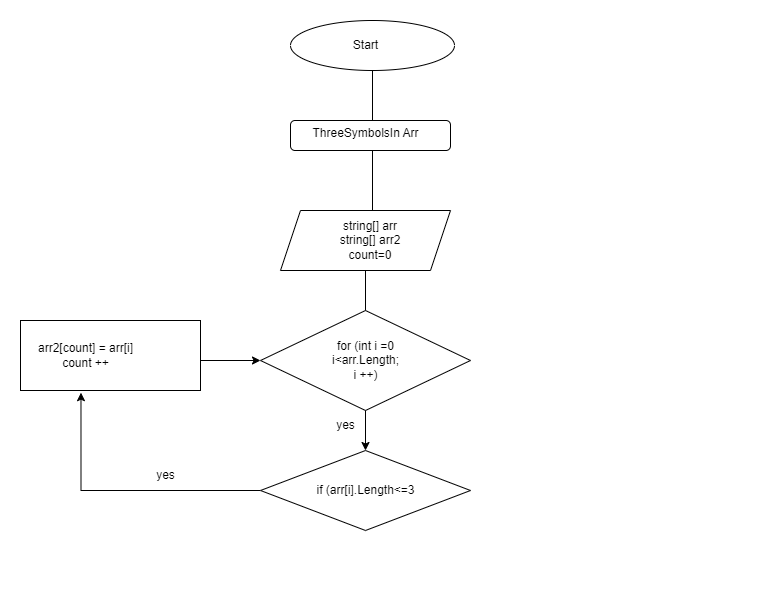

 # Решение задачи.

1 Создаем необходимые массивы *arr и arr2*

2 Создаем функцию для поиска элементов с тремя символами, которая присваивает ее новому массиву *ThreeSymbolsInArr*

3 Создаем функцию *PrintArr*

4 Выводим на экран решение

добавлена блок-схема:
